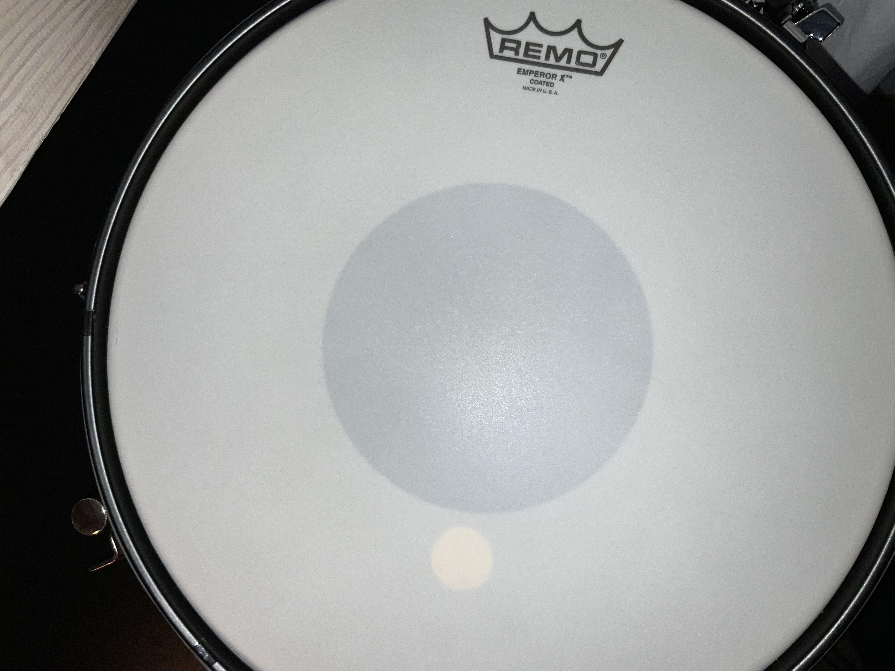
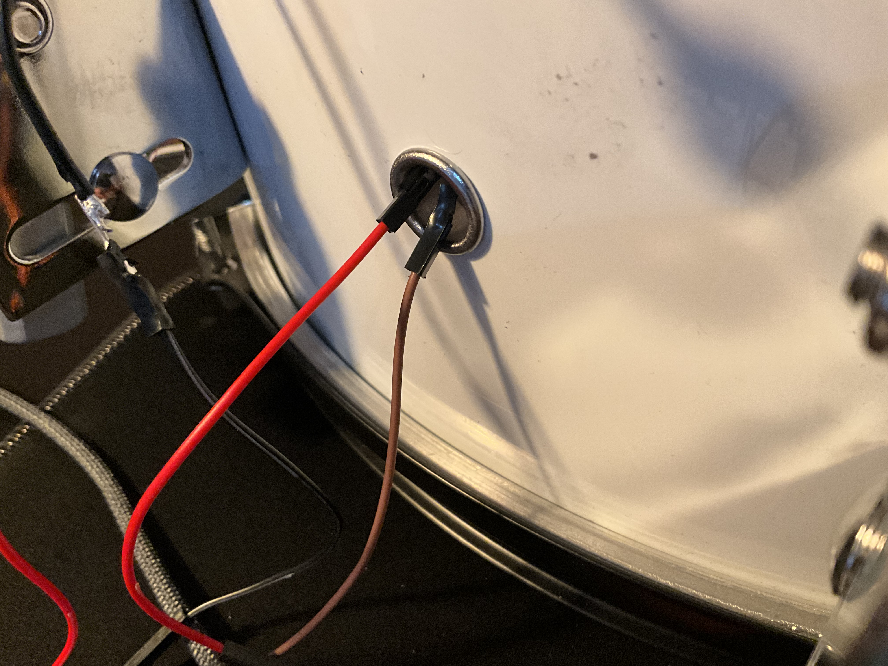
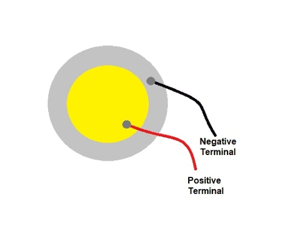
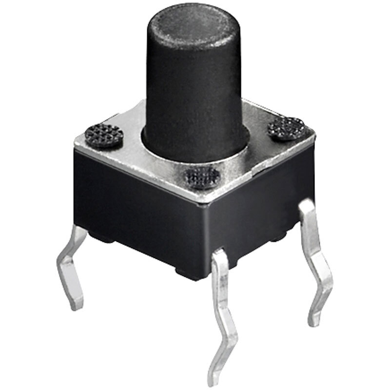
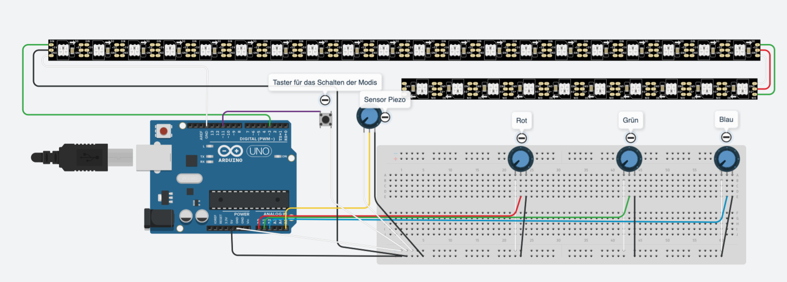
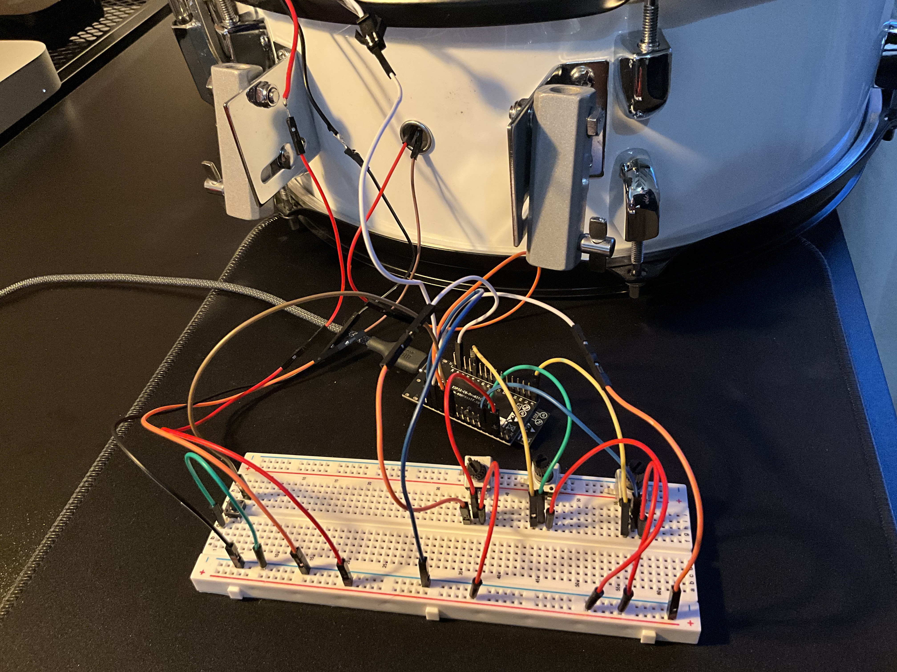

# Aufbau

## Was benötigt wird

- Snare oder andere Trommel  
  &rarr; Fell muss abmontiert werden
- Obligatorisch ein ESP32 mit WIFI Funktionalität
<table>
  <tr>
    <td align="center">
      
    </td>
  </tr>
</table>

- Piezo Sensor
  &rarr; mit Tesafilm möglichst Richtung die Mitte des oberen Fells kleben

<table>
  <tr>
    <th>Piezo-Positionierung</th>
    <th>Piezo-Verkabelung</th>
  </tr>
  <tr>
    <td align="center">
      
    </td>
    <td align="center">
      
    </td>
  </tr>
</table>

- LED Streifen _(Länge muss im Code angegeben werden)_

Adafruit_NeoPixel pixels(NUMPIXELS, PIN, NEO_GRB + Signal-Frequenz);

- 

  3 Potentiometer &rarr; für die Modi und die Farben
  

- 

  1 Taster
  

- Viele Jumper Kabel
- Optional: eine Steckplatine, damit man nicht löten muss
- Tesafilm oder Kleber  
  &rarr; zum Anbringen des LED Streifens und des Piezo Sensors

## Zum Aufbau

<table>
  <tr>
    <th>Schaltplan</th>
    <th>Beispiel Aufbau</th>
  </tr>
  <tr>
    <td align="center">
      
    </td>
    <td align="center">
      
    </td>
  </tr>
</table>
